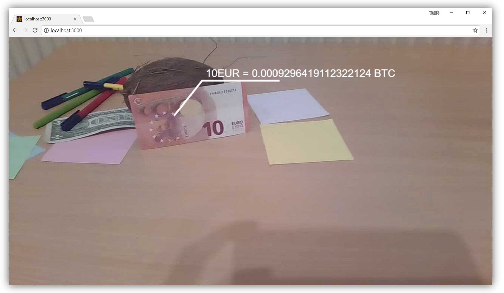

# Banknote detection and display of BTC value of note in a interactive way

## Povzetek
Projekt želi omogočiti uporabniku zabaven in interaktiven vpogled v trenutno bitcoin (BTC) vrednost. S tem, ko uporabnik drži bankovec v roki, dobi boljši občutek o digitalni valuti (v primeru projekta BTC).

Projekt je razdeljen na dva dela. Uporabniški del aplikacije, ki je zadolžen za izris in dodajanje učinkov slike kamere, ter za izris vrednosti BTC (če je bankovec bil zaznan). Drugi del je zaledni del aplikacije, zadolžen za zaznavo bankovca ter njene vrednosti in lokacije.

Primer kako zaledni del zazna bankovce je viden na priloženem videoposnetku `under_the_hood_detection_demo.avi`.

